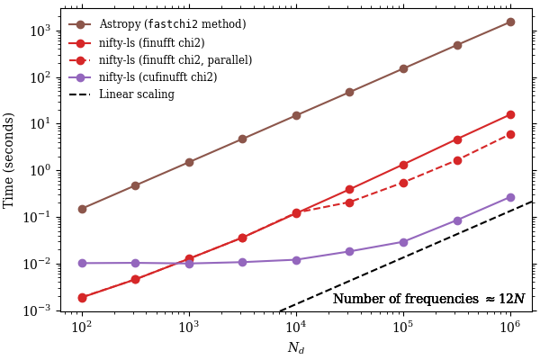
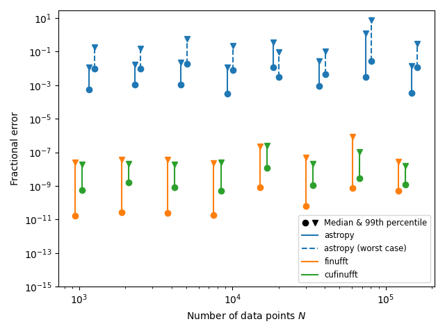

# nifty-ls
A fast Lomb-Scargle periodogram. It's nifty, and uses a NUFFT!

[](https://pypi.org/project/nifty-ls/) [](https://github.com/flatironinstitute/nifty-ls/actions/workflows/tests.yml) [](https://results.pre-commit.ci/latest/github/flatironinstitute/nifty-ls/main) [](https://jenkins.flatironinstitute.org/job/nifty-ls/job/main/) [](https://arxiv.org/abs/2409.08090)

## Overview
The Lomb-Scargle periodogram, used for identifying periodicity in irregularly-spaced
observations, is useful but computationally expensive. However, it can be
phrased mathematically as a pair of non-uniform FFTs (NUFFTs). This allows us to
leverage Flatiron Institute's [finufft](https://github.com/flatironinstitute/finufft/)
package, which is really fast! It also enables GPU (CUDA) support and is
several orders of magnitude more accurate than
[Astropy's Lomb Scargle](https://docs.astropy.org/en/stable/timeseries/lombscargle.html)
with default settings.

## Background
The [Press & Rybicki (1989) method](https://ui.adsabs.harvard.edu/abs/1989ApJ...338..277P/abstract) for Lomb-Scargle poses the computation as four weighted trigonometric sums that are solved with a pair of FFTs by "extirpolation" to an equi-spaced grid. Specifically, the sums are of the form:

```math
\begin{align}
S_k &= \sum_{j=1}^M h_j \sin(2 \pi f_k t_j), \\
C_k &= \sum_{j=1}^M h_j \cos(2 \pi f_k t_j),
\end{align}
```


where the $k$ subscript runs from 0 to $N$, the number of frequency bins, $f_k$ is the cyclic frequency of bin $k$, $t_j$ are the observation times (of which there are $M$), and $h_j$ are the weights.

The key observation for our purposes is that this is exactly what a non-uniform FFT computes! Specifically, a "type-1" (non-uniform to uniform) complex NUFFT in the [finufft convention](https://finufft.readthedocs.io/en/latest/math.html) computes:

```math
g_k = \sum_{j=1}^M h_j e^{i k t_j}.
```

The complex and real parts of this transform are Press & Rybicki's $S_k$ and $C_k$, with some adjustment for cyclic/angular frequencies, domain of $k$, real vs. complex transform, etc. finufft has a particularly fast and accurate spreading kernel ("exponential of semicircle") that it uses instead of Press & Rybicki's extirpolation.

There is some pre- and post-processing of $S_k$ and $C_k$ to compute the periodogram, which can become the bottleneck because finufft is so fast. This package also optimizes and parallelizes those computations.

### Fast $\chi^2$ Method (`nterms > 1`)
[Palmer (2009)](https://ui.adsabs.harvard.edu/abs/2009ApJ...695..496P/abstract) extends the Lomb-Scargle model with a specified number of harmonics (called `nterms` in [Astropy](https://docs.astropy.org/en/v7.1.0/timeseries/lombscargle.html#additional-arguments)). This is implemented as a $\chi^2$ minimization at each frequency, requiring solving $N$ small matrix systems. This method is also amenable to FINUFFT acceleration, as the terms in these matrices can be computed with a NUFFT.

Because FINUFFT is so fast, the matrix assembly and linear‐algebra solve can be the primary bottlenecks of the fast $\chi^2$ method. These routines and other computational steps have been optimized and parallelized in nifty-ls.

## Installation
### From PyPI
For CPU support:

```console
$ pip install nifty-ls
```

For GPU (CUDA) support:

```console
$ pip install nifty-ls[cuda]
```

The default is to install with CUDA 12 support; one can use `nifty-ls[cuda11]` instead for CUDA 11 support (installs `cupy-cuda11x`).

### From source
First, clone the repo and `cd` to the repo root:
```console
$ git clone https://www.github.com/flatironinstitute/nifty-ls
$ cd nifty-ls
```

Then, to install with CPU support:

```console
$ pip install .
```

To install with GPU (CUDA) support:

```console
$ pip install .[cuda]
```

or `.[cuda11]` for CUDA 11.

For development (with automatic rebuilds enabled by default in `pyproject.toml`):
```console
$ pip install nanobind scikit-build-core setuptools_scm ninja
$ pip install -e . --group dev --no-build-isolation
```

Developers may also be interested in setting these keys in `pyproject.toml`:

```toml
[tool.scikit-build]
cmake.build-type = "Debug"
cmake.verbose = true
install.strip = false
```

### For best performance
You may wish to compile and install finufft and cufinufft yourself so they will be
built with optimizations for your hardware. To do so, first install nifty-ls, then
follow the Python installation instructions for
[finufft](https://finufft.readthedocs.io/en/latest/install.html#building-a-python-interface-to-a-locally-compiled-library)
and
[cufinufft](https://finufft.readthedocs.io/en/latest/install_gpu.html#python-interface),
configuring the libraries as desired. Note that (cu)finufft is not bundled with nifty-ls, but is instead used through its Python interface.

nifty-ls can likewise be built from source following the instructions above for
best performance, but most of the heavy computations are offloaded to (cu)finufft,
so the performance benefit is minimal.

## Usage
### From Astropy
Importing `nifty_ls` makes nifty-ls available via `method="fastnifty"` in
Astropy's LombScargle module. The name is prefixed with "fast" as it's part
of the fast family of methods that assume a regularly-spaced frequency grid.

```python
import nifty_ls
from astropy.timeseries import LombScargle
frequency, power = LombScargle(t, y).autopower(method="fastnifty")
```

For `nterms > 1`, pass the `"fastnifty_chi2"` method:

```python
frequency_chi2, power_chi2 = LombScargle(t, y, nterms=2).autopower(method="fastnifty_chi2")
```

<details>
<summary>Full example</summary>

```python
import matplotlib.pyplot as plt
import nifty_ls
import numpy as np
from astropy.timeseries import LombScargle

rng = np.random.default_rng(seed=123)
N = 1000
t = rng.uniform(0, 100, size=N)
y = np.sin(50 * t) + 1 + rng.poisson(size=N)

frequency, power = LombScargle(t, y).autopower(method='fastnifty')

nterms = 4
frequency_chi2, power_chi2 = LombScargle(t, y, nterms=nterms).autopower(method='fastnifty_chi2')

plt.figure(figsize=(12, 5))

# Plot 1: Single component signal
plt.subplot(1, 2, 1)
plt.plot(frequency, power, label='nifty-ls (single component)')
plt.xlabel('Frequency (cycles per unit time)')
plt.ylabel('Power')
plt.title('Single Component Signal')
plt.legend()

# Plot 2: Two component signal with chi2
plt.subplot(1, 2, 2)
plt.plot(frequency_chi2, power_chi2, label='nifty-ls Chi2 (multi-component)', color='red')
plt.xlabel('Frequency (cycles per unit time)')
plt.ylabel('Power')
plt.title('Multi-Component Signal (nterms=4)')
plt.legend()

plt.tight_layout()
plt.show()
```  
</details>

To use the CUDA (cufinufft) backend, pass the appropriate argument via `method_kws`:

```python
frequency, power = LombScargle(t, y).autopower(method="fastnifty", method_kws=dict(backend="cufinufft"))
```

Likewise, for `nterms > 1`:

```python
frequency_chi2, power_chi2 = LombScargle(t, y, nterms=2).autopower(method="fastnifty_chi2", method_kws=dict(backend="cufinufft_chi2"))
```

In many cases, accelerating your periodogram is as simple as setting the `method`
in your Astropy Lomb Scargle code! More advanced usage, such as computing multiple
periodograms in parallel, should go directly through the nifty-ls interface.


### From nifty-ls (native interface)

nifty-ls has its own interface that offers more flexibility than the Astropy
interface for batched periodograms.

#### Single periodograms

A single periodogram can be computed through nifty-ls as:

```python
import nifty_ls
# with automatic frequency grid:
nifty_res = nifty_ls.lombscargle(t, y, dy)

# with automatic backend method selection:
nifty_res_chi2 = nifty_ls.lombscargle(t, y, dy, nterms=4)

# with user-specified frequency grid:
nifty_res = nifty_ls.lombscargle(t, y, dy, fmin=0.1, fmax=10, Nf=10**6)

# with user-specified backend method:
nifty_res_chi2 = nifty_ls.lombscargle(t, y, dy, Nf=10**6, nterms=4, backend='finufft_chi2')
```

<details>
<summary>Full example</summary>

```python
import matplotlib.pyplot as plt
import nifty_ls
import numpy as np

rng = np.random.default_rng(seed=123)
N = 1000
t = np.sort(rng.uniform(0, 100, size=N))
y = np.sin(50 * t) + 1 + rng.poisson(size=N)

# with automatic frequency grid:
nifty_res = nifty_ls.lombscargle(t, y)

# Automatically selects the backend method based on the available options and the specified nterms:
nifty_res_chi2 = nifty_ls.lombscargle(t, y, dy=None, nterms=4)

# with user-specified frequency grid:
nifty_res = nifty_ls.lombscargle(t, y, fmin=0.1, fmax=10, Nf=10**6)

# with user-specified backend method:
nifty_res_chi2 = nifty_ls.lombscargle(t, y, dy=None, Nf=10**6, nterms=4, backend='finufft_chi2')

plt.figure(figsize=(12, 5))

# Plot 1: Finufft Grid
plt.subplot(1, 2, 1)
plt.plot(nifty_res.freq(), nifty_res.power, label='Default Grid')
plt.xlabel('Frequency (cycles per unit time)')
plt.ylabel('Power')
plt.title('Default Grid')
plt.legend()

# Plot 2: Finufft_chi2 Backend
plt.subplot(1, 2, 2)
plt.plot(nifty_res_chi2.freq(), nifty_res_chi2.power, label='Chi2 Backend', color='red')
plt.xlabel('Frequency (cycles per unit time)')
plt.ylabel('Power')
plt.title('Chi2 Backend (nterms=4)')
plt.legend()

plt.tight_layout()
plt.show()
```
</details>

#### Batched Periodograms

Batched periodograms (multiple objects with the same observation times) can be
computed as:

```python
import nifty_ls
import numpy as np

N_t = 100
N_obj = 10
Nf = 200

rng = np.random.default_rng()
t = np.sort(rng.random(N_t))
obj_freqs = rng.random(N_obj).reshape(-1,1)
y_batch = np.sin(obj_freqs * t)
dy_batch = rng.random(y_batch.shape)

batched = nifty_ls.lombscargle(t, y_batch, dy_batch, Nf=Nf)

# Similarly for Chi2 method
batched_chi2 = nifty_ls.lombscargle(t, y_batch, dy_batch, Nf=Nf, nterms=4)

print(batched.power.shape)  # (10, 200)
print(batched_chi2.power.shape)  # same: (10, 200)
```

Note that this computes multiple periodograms simultaneously on a set of time
series with the same observation times.  This approach is particularly efficient
for short time series, and/or when using the GPU.

Batching multiple time series with distinct observation times is not directly supported
currently, but a similar effect can be achieved with [free-threaded Python](#free-threaded-parallelism).

### Free-Threaded Parallelism
nifty-ls supports [free-threaded Python](https://docs.python.org/3/howto/free-threading-python.html)
since version 1.1.0. With a free-threaded build of Python, efficient parallelism over many time
series with distinct observation times can be achieved with:

```python
from concurrent.futures import ThreadPoolExecutor

with ThreadPoolExecutor(max_workers=nthreads) as executor:
    futures = [
        executor.submit(nifty_ls.lombscargle, t, y, nthreads=1) for (t,y) in zip(t_values, y_values)
    ]
results = [future.result() for future in futures]
```

<details>
<summary>Full example</summary>

```python
import concurrent.futures

import matplotlib.pyplot as plt
import nifty_ls
import numpy as np

N_periodograms = 200
N_points_poisson = 10000
python_threads = 32  # "None" will use all CPUs
rng = np.random.default_rng(42)

t_values = []
y_values = []
frequencies = rng.uniform(0.1, 100.0, size=N_periodograms)

for i in range(N_periodograms):
    n_points = rng.poisson(N_points_poisson)
    t = np.sort(rng.uniform(0, 100, size=n_points))
    y = np.sin(2 * np.pi * frequencies[i] * t) + 0.1 * rng.normal(size=n_points)
    t_values.append(t)
    y_values.append(y)

with concurrent.futures.ThreadPoolExecutor(max_workers=python_threads) as executor:
    futures = [
        executor.submit(nifty_ls.lombscargle, t, y, nthreads=1) for (t,y) in zip(t_values, y_values)
    ]

results = [future.result() for future in futures]

fig, axes = plt.subplots(N_periodograms, 1, figsize=(6, 2 * N_periodograms), constrained_layout=True)
for i in range(N_periodograms):
    axes[i].plot(results[i].freq(), results[i].power)
    axes[i].set_title(f"Periodogram {i + 1}")
    axes[i].set_xlabel("Frequency")
    axes[i].set_ylabel("Power")

plt.show()
plt.savefig("periodograms.png", dpi=300, bbox_inches="tight")
```
</details>

This approach allows you to compute multiple heterogeneous periodograms in parallel. A similar effect can be achieved with multiple processes, but this is less efficient due to the overhead of inter-process communication.

Astropy (as of version 7.1.0) does not support free-threaded Python, however. Be alert for messages printed to the interpreter that free threading is disabled due to Astropy, and remove Astropy from your environment if necessary.

Note that each nifty-ls computation may use multiple OpenMP threads internally. To avoid spawning too many threads, we recommend setting `nthreads=1` in the call to nifty-ls.


### Limitations
The code only supports frequency grids with fixed spacing; however, finufft does
support type 3 NUFFTs (non-uniform to non-uniform), which would enable arbitrary
frequency grids. It's not clear how useful this is, so it hasn't been implemented,
but please open a GitHub issue if this is of interest to you.

## Performance

Using 16 cores of an Intel Icelake CPU and a NVIDIA A100 GPU, we obtain the following performance. First, we'll look at results from a single periodogram (i.e. unbatched):


In this case, finufft is 5× faster (11× with threads) than Astropy for large transforms, and 2× faster for (very) small transforms.  Small transforms improve futher relative to Astropy with more frequency bins. (Dynamic multi-threaded dispatch of transforms is planned as a future feature which will especially benefit small $N$.)

cufinufft is 200× faster than Astropy for large $N$! The performance plateaus towards small $N$, mostly due to the overhead of sending data to the GPU and fetching the result. (Concurrent job execution on the GPU is another planned feature, which will especially help small $N$.)

Similar performance trends are observed for the $\chi^2$ method. The following results use `nterms=4` as an example:



In this case, finufft is 100× faster than Astropy's `fastchi2` method, and 300× faster with multi-threading enabled. cufinufft achieves an impressive 5600× speedup over Astropy for large $N$! However, it suffers from similar overhead for small $N$ due to data transfer costs between CPU and GPU. The performance gain being larger for the $\chi^2$ method than the standard method is partially due to the greater number of NUFFTs in this method, and partially due to the large number of small matrix operations, which nifty-ls accelerates.

The following demonstrates "batch mode", in which 10 periodograms are computed from 10 different time series with the same observation times:


Here, the finufft single-threaded advantage is consistently 6× across problem sizes, while the multi-threaded advantage is up to 30× for large transforms.

The 200× advantage of the GPU extends to even smaller $N$ in this case, since we're sending and receiving more data at once.

We see that both multi-threaded finufft and cufinufft particularly benefit from batched transforms, as this exposes more parallelism and amortizes fixed latencies.

<!-- FUTURE: move to a readthedocs page and include the following performance plot

In contrast, the following shows "batch mode" performance for the chi-squared method under the same setting and `nterms=4`:


Compared to the standard finufft method, the chi-squared method shows less single-thread performance gain when scaling from a single batch to multiple batches. This is because its primary bottlenecks lie in data processing tasks like matrix construction and solving linear systems, rather than the NUFFT transform itself. 

Nevertheless, multi-threaded execution achieves up to a 430× speedup, owing to the fact that computations at each frequency are independent and can be efficiently parallelized across threads.

However, due to GPU memory limitations, running cufinufft with a large batch size and number of data points (batch_size>=10 and N>=1000_000) will results in a CUDA out-of-memory error. -->

We use `FFTW_MEASURE` for finufft in these benchmarks, which improves performance a few tens of percents.

Multi-threading hurts the performance of small problem sizes; the default behavior of nifty-ls is to use fewer threads in such cases. The "multi-threaded" line uses between 1 and 16 threads.

On the CPU, nifty-ls gets its performance not only through its use of finufft, but also
by offloading the pre- and post-processing steps to compiled extensions. The extensions
enable us to do much more processing element-wise, rather than array-wise. In other words,
they enable "kernel fusion" (to borrow a term from GPU computing), increasing the compute
density.


## Accuracy
While we compared performance with Astropy's `fast` and `fastchi2` methods, this isn't quite fair. nifty-ls is much more accurate than Astropy `fast` and `fastchi2`!  These Astropy methods use Press & Rybicki's extirpolation approximation, trading accuracy for speed, but thanks to finufft, nifty-ls can have both.

In the figure below, we plot the median periodogram error in circles and the 99th percentile error in triangles for astropy, finufft, and cufinufft for a range of $N$ (and default $N_F \approx 12N$).

The astropy result is presented for two cases: a nominal case and a "worst case". Internally, astropy uses an FFT grid whose size is the next power of 2 above the target oversampling rate. Each jump to a new power of 2 typically yields an increase in accuracy. The "worst case", therefore, is the highest frequency that does not yield such a jump.



Errors of $\mathcal{O}(10\%)$ or greater are common with worst-case evaluations. Errors of $\mathcal{O}(1\%)$ or greater are common in typical evaluations. nifty-ls is conservatively 6 orders of magnitude more accurate.

The reference result in the above figure comes from the "phase winding" method, which uses trigonometric identities to avoid expensive sin and cos evaluations. One can also use astropy's `fast` method or `fastchi2` method as a reference with exact evaluation enabled via `use_fft=False`, and one finds the same result. The phase winding is used because it is a few orders of magnitude faster (but still not competitive with finufft).

The following shows a similar accuracy comparison for the $\chi^2$ variants, finding similar results:


In summary, nifty-ls is highly accurate while also giving high performance.

### Numerics

#### float32 vs float64
While 32-bit floats provide a substantial speedup for finufft and cufinufft, we generally don't recommend their use for Lomb-Scargle. The reason is the challenging [condition number](https://en.wikipedia.org/wiki/Condition_number) of the problem.  The condition number is the response in the output to a small perturbation in the input—in other words, the derivative. [It can easily be shown](https://finufft.readthedocs.io/en/latest/trouble.html) that the derivative of a NUFFT with respect to the non-uniform points is proportional to $N$, the transform length (i.e. the number of modes). In other words, errors in the observation times are amplified by $\mathcal{O}(N)$.  Since float32 has a relative error of $\mathcal{O}(10^{-7})$, transforms of length $10^5$ already suffer $\mathcal{O}(1\%)$ error. Therefore, we focus on float64 in nifty-ls, but float32 is also natively supported by all backends for adventurous users.

The condition number is also a likely contributor to the mild upward trend in error versus $N$ in the above figure, at least for finufft/cufinufft. With a relative error of $\mathcal{O}(10^{-16})$ for float64 and a transform length of $\mathcal{O}(10^{6})$, the minimum error is $\mathcal{O}(10^{-10})$.

#### Fast $\chi^2$ matrix condition number
In the $\chi^2$ backends with `nterms > 1`, users should be aware that the first few modes tend to have ill-conditioned matrices, especially when using the default frequency grid. Each matrix represents a Fourier mode and its `nterms` harmonics, and the loss of conditioning appears to represent a loss of linear independence between the harmonics because the default minimum frequency (inherited from Astropy) is so low. In other words, the harmonics are not picking up appreciably different power across the signal. Solving for the harmonic amplitudes is thus under-constrained, which can amplify differences between nifty-ls and Astropy. Most users will not notice this unless directly comparing Astropy and nifty-ls periodograms, but if you encounter this, consider using fewer `nterms` or a higher minimum frequency.

## Testing
First, install from source (`pip install . --group test`). Then, from the repo root, run:

```console
$ pytest
```

Or, with uv, the previous steps can be combined as:

```console
$ uv run pytest
```

The tests are defined in the `tests/` directory, and include a mini-benchmark of
nifty-ls and Astropy, shown below:

```
$ pytest
============================= test session starts ==============================
platform linux -- Python 3.10.13, pytest-8.4.0, pluggy-1.6.0
benchmark: 5.1.0 (defaults: timer=time.perf_counter disable_gc=True min_rounds=5 min_time=0.000005 max_time=1.0 calibration_precision=10 warmup=False warmup_iterations=100000)
rootdir: /mnt/home/psun1/nifty_ls_nterm_support/nifty-ls
configfile: pyproject.toml
plugins: asdf-4.3.0, benchmark-5.1.0
collected 82 items

tests/test_ls.py ....................................................... [ 67%]
..........                                                               [ 79%]
tests/test_perf.py .................                                     [100%]


------------------------------------ benchmark 'batched_standard Nf=1000': 5 tests -------------------------------------
Name (time in ms)                                Min                Mean            StdDev            Rounds  Iterations
------------------------------------------------------------------------------------------------------------------------
test_batched_standard[cufinufft-1000]         6.1639 (1.0)        6.6860 (1.0)      0.4799 (4.07)         83           1
test_batched_standard[finufft-1000]          17.5466 (2.85)      26.0489 (3.90)     7.5615 (64.16)        40           1
test_unbatched_standard[finufft-1000]       140.0611 (22.72)    140.2554 (20.98)    0.1179 (1.0)           8           1
test_unbatched_standard[astropy-1000]       201.8929 (32.75)    202.0876 (30.23)    0.2012 (1.71)          5           1
test_unbatched_standard[cufinufft-1000]     300.5980 (48.77)    305.7871 (45.74)    4.1439 (35.16)         5           1
------------------------------------------------------------------------------------------------------------------------

----------------------------------------- benchmark 'chi2_nterms4 Nf=10000': 3 tests -----------------------------------------
Name (time in ms)                                    Min                  Mean            StdDev            Rounds  Iterations
------------------------------------------------------------------------------------------------------------------------------
test_chi2_nterms4[cufinufft_chi2-10000]          10.1617 (1.0)         10.2186 (1.0)      0.1002 (2.51)         85           1
test_chi2_nterms4[finufft_chi2-10000]            11.9403 (1.18)        11.9854 (1.17)     0.0399 (1.0)          78           1
test_chi2_nterms4[astropy_fastchi2-10000]     9,430.5506 (928.05)   9,437.9781 (923.61)   5.2359 (131.36)        5           1
------------------------------------------------------------------------------------------------------------------------------

---------------------------------- benchmark 'standard Nf=10000': 3 tests ---------------------------------
Name (time in ms)                     Min              Mean            StdDev            Rounds  Iterations
-----------------------------------------------------------------------------------------------------------
test_standard[finufft-10000]       2.3321 (1.0)      2.3486 (1.0)      0.0084 (1.0)         391           1
test_standard[cufinufft-10000]     2.8325 (1.21)     2.8743 (1.22)     0.0229 (2.72)        268           1
test_standard[astropy-10000]       5.7358 (2.46)     5.7815 (2.46)     0.1054 (12.54)       150           1
-----------------------------------------------------------------------------------------------------------

---------------------------------- benchmark 'standard Nf=100000': 3 tests -----------------------------------
Name (time in ms)                       Min               Mean            StdDev            Rounds  Iterations
--------------------------------------------------------------------------------------------------------------
test_standard[cufinufft-100000]      3.6294 (1.0)       3.6634 (1.0)      0.0608 (1.0)         237           1
test_standard[finufft-100000]        8.0218 (2.21)      8.9424 (2.44)     2.0032 (32.93)        74           1
test_standard[astropy-100000]       45.1638 (12.44)    45.5427 (12.43)    0.4489 (7.38)         19           1
--------------------------------------------------------------------------------------------------------------

-------------------------------------- benchmark 'standard Nf=1000000': 3 tests --------------------------------------
Name (time in ms)                           Min                  Mean             StdDev            Rounds  Iterations
----------------------------------------------------------------------------------------------------------------------
test_standard[cufinufft-1000000]         5.5406 (1.0)          5.6519 (1.0)       0.1557 (1.0)         146           1
test_standard[finufft-1000000]          80.2681 (14.49)       90.6020 (16.03)    11.3134 (72.67)        10           1
test_standard[astropy-1000000]       1,207.3889 (217.92)   1,210.8376 (214.23)    4.5923 (29.50)         5           1
----------------------------------------------------------------------------------------------------------------------

Legend:
  Outliers: 1 Standard Deviation from Mean; 1.5 IQR (InterQuartile Range) from 1st Quartile and 3rd Quartile.
  OPS: Operations Per Second, computed as 1 / Mean
======================== 82 passed in 167.49s (0:02:47) ========================
```

The results were obtained using 16 cores of an Intel Icelake CPU and 1 NVIDIA A100 GPU.
The ratio of the runtime relative to the fastest are shown in parentheses. You may obtain
very different performance on your platform! The slowest Astropy results in particular may
depend on the Numpy distribution you have installed and its trig function performance.

## Authors
nifty-ls was originally implemented by [Lehman Garrison](https://github.com/lgarrison)
based on work done by [Dan Foreman-Mackey](https://github.com/dfm) in the
[dfm/nufft-ls](https://github.com/dfm/nufft-ls) repo, with consulting from
[Alex Barnett](https://github.com/ahbarnett).

## Citation
If you use nifty-ls in an academic work, please cite our RNAAS research note:

```bibtex
@article{Garrison_2024,
  doi = {10.3847/2515-5172/ad82cd},
  url = {https://dx.doi.org/10.3847/2515-5172/ad82cd},
  year = {2024},
  month = {oct},
  publisher = {The American Astronomical Society},
  volume = {8},
  number = {10},
  pages = {250},
  author = {Lehman H. Garrison and Dan Foreman-Mackey and Yu-hsuan Shih and Alex Barnett},
  title = {nifty-ls: Fast and Accurate Lomb–Scargle Periodograms Using a Non-uniform FFT},
  journal = {Research Notes of the AAS},
  abstract = {We present nifty-ls, a software package for fast and accurate evaluation of the Lomb–Scargle periodogram. nifty-ls leverages the fact that Lomb–Scargle can be computed using a non-uniform fast Fourier transform (NUFFT), which we evaluate with the Flatiron Institute NUFFT package (finufft). This approach achieves a many-fold speedup over the Press &amp; Rybicki method as implemented in Astropy and is simultaneously many orders of magnitude more accurate. nifty-ls also supports fast evaluation on GPUs via CUDA and integrates with the Astropy Lomb–Scargle interface. nifty-ls is publicly available at https://github.com/flatironinstitute/nifty-ls/.}
}
```

A pre-print of the article is available on arXiv: https://arxiv.org/abs/2409.08090

## Acknowledgements
nifty-ls builds directly on top of the excellent finufft package by Alex Barnett
and others (see the [finufft Acknowledgements](https://finufft.readthedocs.io/en/latest/ackn.html)).

Many parts of this package are an adaptation of [Astropy LombScargle](https://docs.astropy.org/en/stable/timeseries/lombscargle.html), in particular the Press & Rybicki (1989) method.
