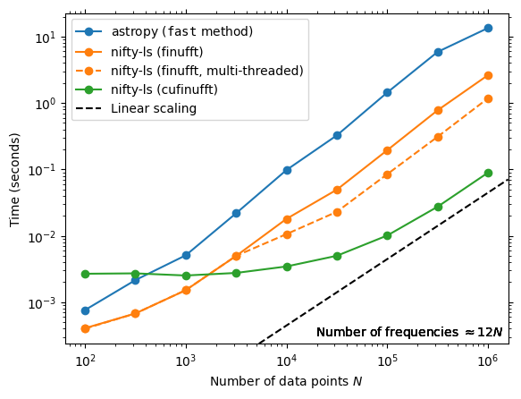
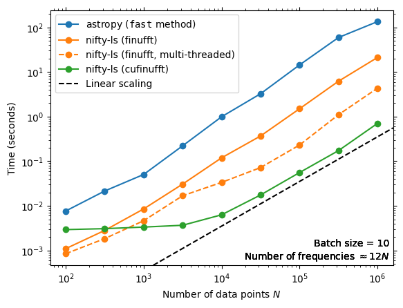

# nifty-ls
A fast Lomb-Scargle periodogram. It's nifty, and uses a NUFFT!

[](https://pypi.org/project/nifty-ls/) [](https://github.com/flatironinstitute/nifty-ls/actions/workflows/tests.yml) [](https://results.pre-commit.ci/latest/github/flatironinstitute/nifty-ls/main) [](https://jenkins.flatironinstitute.org/job/nifty-ls/job/main/)

> [!WARNING]
> This project is in a pre-release stage and will likely undergo breaking changes during development. Some of the instructions in the README are aspirational.

## Overview
The Lomb-Scargle periodogram, used for identifying periodicity in irregularly-spaced
observations, is useful but computationally expensive. However, it can be
phrased mathematically as a pair of non-uniform FFTs (NUFFTs). This allows us to
leverage Flatiron Institute's [finufft](https://github.com/flatironinstitute/finufft/)
package, which is really fast! It also enables GPU (CUDA) support and is
several orders of magnitude more accurate than
[Astropy's Lomb Scargle](https://docs.astropy.org/en/stable/timeseries/lombscargle.html)
with default settings for many regions of parameter space.

## Background
The [Press & Rybicki (1989) method](https://ui.adsabs.harvard.edu/abs/1989ApJ...338..277P/abstract) for Lomb-Scargle poses the computation as four weighted trigonometric sums that are solved with a pair of FFTs by "extirpolation" to an equi-spaced grid. Specifically, the sums are of the form:

```math
\begin{align}
S_k &= \sum_{j=1}^M h_j \sin(2 \pi f_k t_j), \\
C_k &= \sum_{j=1}^M h_j \cos(2 \pi f_k t_j),
\end{align}
```


where the $k$ subscript runs from 0 to $N$, the number of frequency bins, $f_k$ is the cyclic frequency of bin $k$, $t_j$ are the observation times (of which there are $M$), and $h_j$ are the weights.

The key observation for our purposes is that this is exactly what a non-uniform FFT computes! Specifically, a "type-1" (non-uniform to uniform) complex NUFFT in the [finufft convention](https://finufft.readthedocs.io/en/latest/math.html) computes:

```math
g_k = \sum_{j=1}^M h_j e^{i k t_j}.
```

The complex and real parts of this transform are Press & Rybicki's $S_k$ and $C_k$, with some adjustment for cyclic/angular frequencies, domain of $k$, real vs. complex transform, etc. finufft has a particularly fast and accurate spreading kernel ("exponential of semicircle") that it uses instead of Press & Rybicki's extirpolation.

There is some pre- and post-processing of $S_k$ and $C_k$ to compute the periodogram, which can become the bottleneck because finufft is so fast. This package also optimizes and parallelizes those computations.

## Installation
### From PyPI
For CPU support:

```console
$ pip install nifty-ls
```

For GPU (CUDA) support:

```console
$ pip install nifty-ls[cuda]
```

The default is to install with CUDA 12 support; one can use `nifty-ls[cuda11]` instead for CUDA 11 support (installs `cupy-cuda11x`).

### From source
First, clone the repo and `cd` to the repo root:
```console
$ git clone https://www.github.com/flatironinstitute/nifty-ls
$ cd nifty-ls
```

Then, to install with CPU support:

```console
$ pip install .
```

To install with GPU (CUDA) support:

```console
$ pip install .[cuda]
```

or `.[cuda11]` for CUDA 11.

For development (with automatic rebuilds enabled by default in `pyproject.toml`):
```console
$ pip install nanobind scikit-build-core
$ pip install -e .[test] --no-build-isolation
```

Developers may also be interested in setting these keys in `pyproject.toml`:

```toml
[tool.scikit-build]
cmake.build-type = "Debug"
cmake.verbose = true
install.strip = false
```

### For best performance
You may wish to compile and install finufft and cufinufft yourself so they will be
built with optimizations for your hardware. To do so, first install nifty-ls, then
follow the Python installation instructions for
[finufft](https://finufft.readthedocs.io/en/latest/install.html#building-a-python-interface-to-a-locally-compiled-library)
and
[cufinufft](https://finufft.readthedocs.io/en/latest/install_gpu.html#python-interface)
as desired.

nifty-ls can likewise be built from source following the instructions above for
best performance, but most of the heavy computations are offloaded to (cu)finufft,
so the performance benefit is minimal.

## Usage
### From Astropy
Importing `nifty_ls` makes nifty-ls available via `method="fastnifty"` in
Astropy's LombScargle module. The name is prefixed with "fast" as it's part
of the fast family of methods that assume a regularly-spaced frequency grid.

```python
import nifty_ls
from astropy.timeseries import LombScargle
frequency, power = LombScargle(t, y, method="fastnifty").autopower()
```

To use the CUDA (cufinufft) backend, pass the appropriate argument via `method_kws`:

```python
frequency, power = LombScargle(t, y, method="fastnifty", method_kws=dict(backend="cufinufft")).autopower()
```

In many cases, accelerating your periodogram is as simple as setting the `method`
in your Astropy Lomb Scargle code! More advanced usage, such as computing multiple
periodograms in parallel, should go directly through the nifty-ls interface.


### From nifty-ls (native interface)

nifty-ls has its own interface that offers more flexibility than the Astropy
interface for batched periodograms.

#### Single periodograms

A single periodogram can be computed through nifty-ls as:

```python
import nifty_ls
# with automatic frequency grid:
nifty_res = nifty_ls.lombscargle(t, y, dy)

# with user-specified frequency grid:
nifty_res = nifty_ls.lombscargle(t, y, dy, fmin=0.1, fmax=10, Nf=10**6)
```

#### Batched Periodograms

Batched periodograms (multiple objects with the same observation times) can be
computed as:

```python
import nifty_ls
import numpy as np

N_t = 100
N_obj = 10
Nf = 200

rng = np.random.default_rng()
t = rng.random(N_t)
freqs = rng.random(N_obj).reshape(-1,1)
y_batch = np.sin(freqs * t)
dy_batch = rng.random(y.shape)

batched = nifty_ls.lombscargle(t, y_batch, dy_batch, Nf=Nf)
print(batched['power'].shape)  # (10, 200)
```

Note that this computes multiple periodograms simultaneously on a set of time
series with the same observation times.  This approach is particularly efficient
for short time series, and/or when using the GPU.

Support for batching multiple time series with distinct observation times is
not currently implemented, but is planned.


### Limitations
The code only supports frequency grids with fixed spacing; however, finufft does
support type 3 NUFFTs (non-uniform to non-uniform), which would enable arbitrary
frequency grids. It's not clear how useful this is, so it hasn't been implemented,
but please open a GitHub issue if this is of interest to you.

## Performance

Using 16 cores of an Intel Icelake CPU and a NVIDIA A100 GPU, we obtain the following performance. First, we'll look at the performance on a single periodogram (i.e. unbatched):



In this case, finufft is 5x faster (11x with threads) than Astropy for large transforms, and 2x faster for (very) small transforms.  Small transforms improve futher relative to Astropy with more frequency bins. (Dynamic multi-threaded dispatch of transforms is planned as a future feature which will especially benefit small $N$.)

cufinufft is 200x faster than Astropy for large $N$! The performance plateaus towards small $N$, mostly due to the overhead of sending data to the GPU and fetching the result. (Concurrent job execution on the GPU is another planned feature, which will especially help small $N$.)

The following demonstrates "batch mode", in which 10 periodograms are computed from 10 different time series with the same observation times:



Here, the finufft single-threaded advantage is consistently 6x across problem sizes, while the multi-threaded advantage is up to 30x for large transforms.

The 200x advantage of the GPU extends to even smaller $N$ in this case, since we're sending and receiving more data at once.

We see that both multi-threaded finufft and cufinufft particularly benefit from batched transforms, as this exposes more parallelism and amortizes fixed latencies.

We use `FFTW_MEASURE` for finufft in these benchmarks, which improves performance a few tens of percents.

Multi-threading hurts the performance of small problem sizes; the default behavior of nifty-ls is to use fewer threads in such cases. The "multi-threaded" line uses between 1 and 16 threads.

On the CPU, nifty-ls gets its performance not only through its use of finufft, but also
by offloading the pre- and post-processing steps to compiled extensions. The extensions
enable us to do much more processing element-wise, rather than array-wise. In other words,
they enable "kernel fusion" (to borrow a term from GPU computing), increasing the compute
density.


## Accuracy
While we compared performance with Astropy's `fast` method, this isn't quite fair. nifty-ls is substantially more accurate than Astropy `fast`!


## Testing
First, install from source (`pip install .[test]`). Then, from the repo root, run:

```console
$ pytest
```

The tests are defined in the `tests/` directory, and include a mini-benchmark of
nifty-ls and Astropy, shown below:

```
$ pytest
======================================================== test session starts =========================================================
platform linux -- Python 3.10.13, pytest-8.1.1, pluggy-1.4.0
benchmark: 4.0.0 (defaults: timer=time.perf_counter disable_gc=True min_rounds=5 min_time=0.000005 max_time=1.0 calibration_precision=10 warmup=False warmup_iterations=100000)
rootdir: /mnt/home/lgarrison/nifty-ls
configfile: pyproject.toml
plugins: benchmark-4.0.0, asdf-2.15.0, anyio-3.6.2, hypothesis-6.23.1
collected 36 items                                                                                                                   

tests/test_ls.py ......................                                                                                        [ 61%]
tests/test_perf.py ..............                                                                                              [100%]


----------------------------------------- benchmark 'Nf=1000': 5 tests ----------------------------------------
Name (time in ms)                       Min                Mean            StdDev            Rounds  Iterations
---------------------------------------------------------------------------------------------------------------
test_batched[finufft-1000]           6.8418 (1.0)        7.1821 (1.0)      0.1831 (1.32)         43           1
test_batched[cufinufft-1000]         7.7027 (1.13)       8.6634 (1.21)     0.9555 (6.89)         74           1
test_unbatched[finufft-1000]       110.7541 (16.19)    111.0603 (15.46)    0.1387 (1.0)          10           1
test_unbatched[astropy-1000]       441.2313 (64.49)    441.9655 (61.54)    1.0732 (7.74)          5           1
test_unbatched[cufinufft-1000]     488.2630 (71.36)    496.0788 (69.07)    6.1908 (44.63)         5           1
---------------------------------------------------------------------------------------------------------------

--------------------------------- benchmark 'Nf=10000': 3 tests ----------------------------------
Name (time in ms)            Min              Mean            StdDev            Rounds  Iterations
--------------------------------------------------------------------------------------------------
test[finufft-10000]       1.8481 (1.0)      1.8709 (1.0)      0.0347 (1.75)        507           1
test[cufinufft-10000]     5.1269 (2.77)     5.2052 (2.78)     0.3313 (16.72)       117           1
test[astropy-10000]       8.1725 (4.42)     8.2176 (4.39)     0.0198 (1.0)         113           1
--------------------------------------------------------------------------------------------------

----------------------------------- benchmark 'Nf=100000': 3 tests ----------------------------------
Name (time in ms)              Min               Mean            StdDev            Rounds  Iterations
-----------------------------------------------------------------------------------------------------
test[cufinufft-100000]      5.8566 (1.0)       6.0411 (1.0)      0.7407 (10.61)       159           1
test[finufft-100000]        6.9766 (1.19)      7.1816 (1.19)     0.0748 (1.07)        132           1
test[astropy-100000]       47.9246 (8.18)     48.0828 (7.96)     0.0698 (1.0)          19           1
-----------------------------------------------------------------------------------------------------

------------------------------------- benchmark 'Nf=1000000': 3 tests --------------------------------------
Name (time in ms)                  Min                  Mean            StdDev            Rounds  Iterations
------------------------------------------------------------------------------------------------------------
test[cufinufft-1000000]         8.0038 (1.0)          8.5193 (1.0)      1.3245 (1.62)         84           1
test[finufft-1000000]          74.9239 (9.36)        76.5690 (8.99)     0.8196 (1.0)          10           1
test[astropy-1000000]       1,430.4282 (178.72)   1,434.7986 (168.42)   5.5234 (6.74)          5           1
------------------------------------------------------------------------------------------------------------

Legend:
  Outliers: 1 Standard Deviation from Mean; 1.5 IQR (InterQuartile Range) from 1st Quartile and 3rd Quartile.
  OPS: Operations Per Second, computed as 1 / Mean
======================================================== 36 passed in 30.81s =========================================================
```

The results were obtained using 16 cores of an Intel Icelake CPU and 1 NVIDIA A100 GPU.
The ratio of the runtime relative to the fastest are shown in parentheses. You may obtain
very different performance on your platform! The slowest Astropy results in particular may
depend on the Numpy distribution you have installed and its trig function performance.

## Authors
nifty-ls was originally implemented by [Lehman Garrison](https://github.com/lgarrison)
based on work done by [Dan Foreman-Mackey](https://github.com/dfm) in the
[dfm/nufft-ls](https://github.com/dfm/nufft-ls) repo, with consulting from
[Alex Barnett](https://github.com/ahbarnett).

## Acknowledgements
nifty-ls builds directly on top of the excellent finufft package by Alex Barnett
and others (see the [finufft Acknowledgements](https://finufft.readthedocs.io/en/latest/ackn.html)).

Many parts of this package are an adaptation of [Astropy LombScargle](https://docs.astropy.org/en/stable/timeseries/lombscargle.html), in particular the Press & Rybicki (1989) method.
